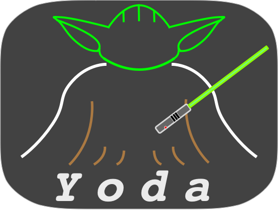

# Yoda-Scheduler


[](https://goreportcard.com/report/github.com/NJUPT-ISL/Yoda-Scheduler)


----

Yoda is a kubernetes scheduler based on [scheduling-framework](https://github.com/kubernetes/enhancements/blob/master/keps/sig-scheduling/20180409-scheduling-framework.md). By cooperation with [SCV Sniffer](https://github.com/NJUPT-ISL/SCV),
 it is schedules tasks according to GPU metrics.
 

## Get Started 

- Make sure kubernetes cluster version is `1.17+` and SCV sniffer is deployed in kubernetes cluster: [SCV: Get-Started](https://github.com/NJUPT-ISL/SCV#get-started)

- Deploy Yoda Scheduler:
```shell
kubectl apply -f https://raw.githubusercontent.com/NJUPT-ISL/Yoda-Scheduler/master/deploy/yoda-scheduler.yaml
```

- Check the Yoda Scheduler Status:
```shell
kubectl get pods -n kube-system 
```
## Deploy a Pod using Yoda
- Create a pod which needs 1000MB GPU Memory:
```yaml
apiVersion: v1
kind: Pod
metadata:
  name: test
  labels:
    scv/memory: "1000"
spec:
  schedulerName: yoda-scheduler
  containers:
    - image: nginx
      name: nginx
```
- Create a pod which needs 2 GPU:
```yaml
apiVersion: v1
kind: Pod
metadata:
  name: test2
  labels:
    scv/number: "2"
spec:
  schedulerName: yoda-scheduler
  containers:
    - image: nginx
      name: nginx
```
- Create a pod that requires a high-performance GPU:
```yaml
apiVersion: v1
kind: Pod
metadata:
  name: test3
  labels:
    scv/clock: "5705"
    scv/memory: "8000"
spec:
  schedulerName: yoda-scheduler
  containers:
    - image: nginx
      name: nginx
```
## Check the sample pod Status:
```shell
kubectl get pods 
```
## How to develop Yoda
- Compile yoda-scheduler:
```shell
make local
```
- Build the docker image:
```shell
make build
```
- Clean the Build file
```shell
make clean
```

## Contact us
